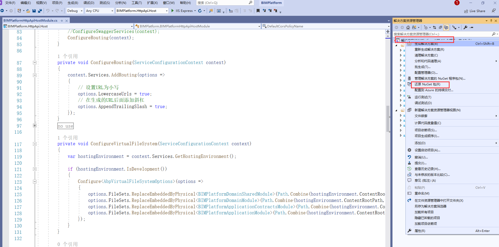
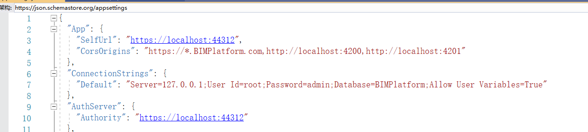
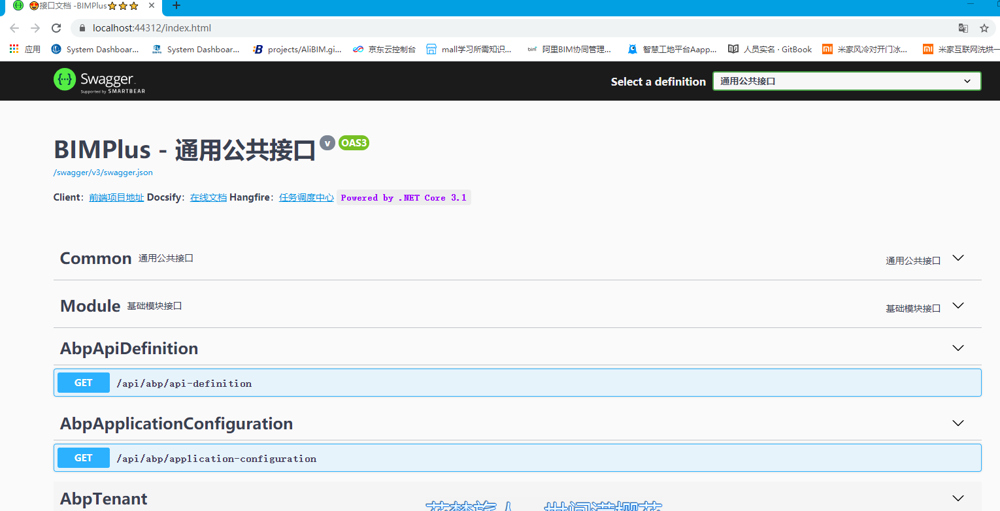

> 后台开发环境:

    1.Visual Studio 2019 (v16.4+) for Windows / Visual Studio for Mac
    2..NET Core 3.1
    3.Node v12 或 v14
    4.maridb 
>前端开发环境：

    1.Visual Studio Code 
    2.eslint
    3.node
> 后台项目初始化搭建：

1. git 下载仓库，打开文件夹aspnet-core 中的解决方案，点击解决方案，还原Nuget 程序包。

2. 修改数据库连接配置，打开 **BIMPlatform.HttpApi.Host** 和 **BIMPlatform.DbMigrator** 中的配置文件 appsettings.json

3. 生成数据库和种子数据，将启动项目修改为 **BIMPlatform.DbMigrator**，点击运行，静待运行结束就可以，查看miradb 中是否生成对应数据库

4. 切换启动项目为**BIMPlatform.HttpApi.Host** ，启动运行就可以

   

> 前端项目运行 

安装环境之后， vs code  打开 vue-element-admin , 运行命令 npm install   ，还原包，npm run dev 运行